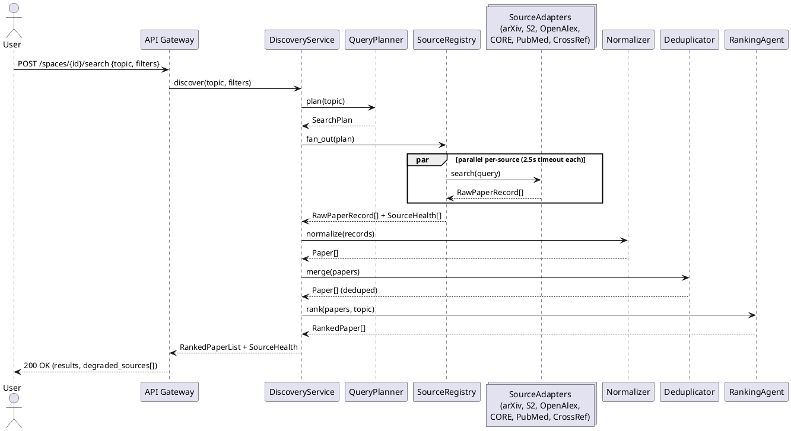
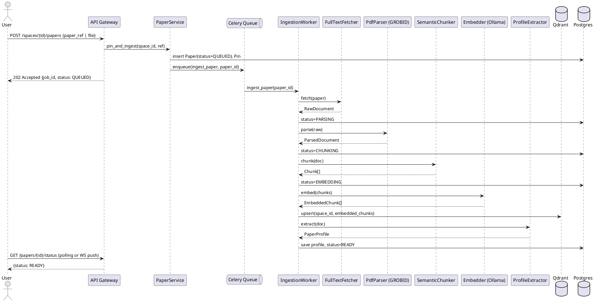
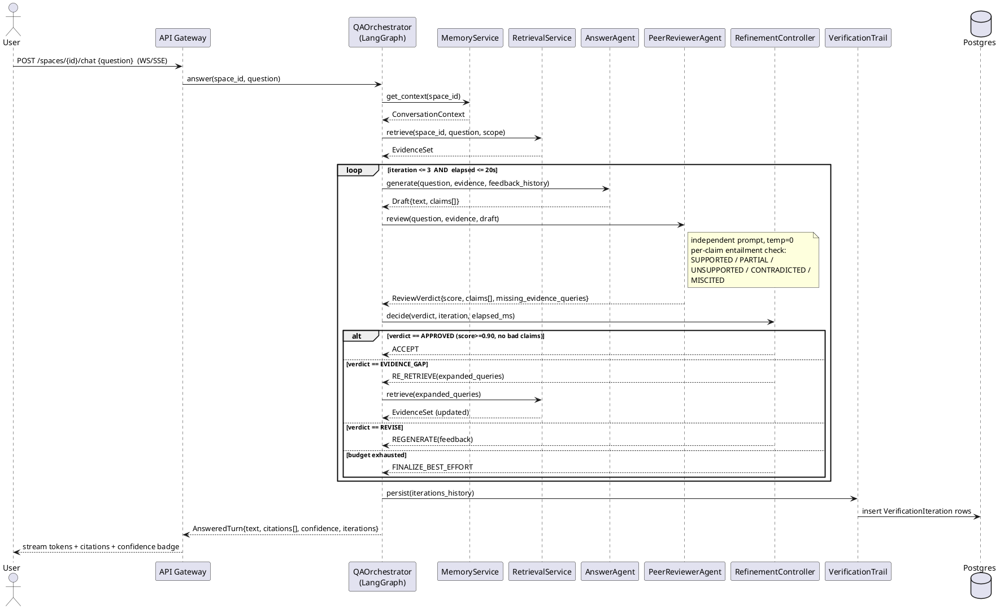
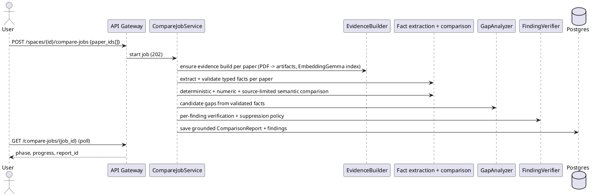

# Research Assistant — System Design

**Version:** 1.0
**Builds on:** `01-requirements.md`, `02-architecture.md`, `03-file-structure.md`
**Feeds into:** `05-class-diagram.puml`

This document moves from architecture (why/what) to system design (how): concrete component
interfaces, request/response contracts, sequence flows, database schema, capacity planning and
error handling — the level of detail needed to derive class diagrams and start implementation.

---

## 1. Component Design

Each component below is designed as a narrow, typed interface so it can later map 1:1 onto a
class/interface in the PlantUML class diagram.

### 1.1 Source Adapters (`SourceAdapter`)

```
interface SourceAdapter:
    name: str
    search(query: SearchQuery) -> list[RawPaperRecord]      # timeout 2.5s, retried once
    fetch_by_id(identifier: PaperIdentifier) -> RawPaperRecord | None
    resolve_fulltext(record: RawPaperRecord) -> FullTextRef | None
    health_check() -> SourceHealth

Implementations: ArxivAdapter, SemanticScholarAdapter, OpenAlexAdapter,
                 COREAdapter, PubMedAdapter, CrossrefAdapter, UnpaywallAdapter
```

Each adapter is wrapped by a `CircuitBreaker` (closed/open/half-open) so one failing source
never blocks the fan-out. `SourceRegistry` holds all adapters and executes `search()` concurrently
with `asyncio.gather(..., return_exceptions=True)`.

### 1.2 Discovery Pipeline

```
DiscoveryService
  .discover(topic: str, filters: SearchFilters) -> RankedPaperList
      1. QueryPlanner.plan(topic) -> SearchPlan (sub-queries, source hints, filters)
      2. SourceRegistry.fan_out(plan) -> list[RawPaperRecord]   (parallel, per-source timeout)
      3. Normalizer.normalize(records) -> list[Paper]           (canonical schema)
      4. Deduplicator.merge(papers) -> list[Paper]               (DOI > arXiv > PMID > fuzzy title)
      5. RankingAgent.rank(papers, topic) -> list[RankedPaper]   (embed sim + rerank + recency/citations)
      6. return top-N with SourceHealth metadata attached
```

### 1.3 Ingestion Pipeline

```
IngestionPipeline
  .ingest(paper_ref: PaperRef | UploadedFile) -> IngestJob   (async, status-tracked)
      stage: QUEUED -> FETCHING -> PARSING -> CHUNKING -> EMBEDDING -> PROFILING -> READY | FAILED

Components:
  FullTextFetcher.fetch(paper) -> RawDocument | None        # OA resolution or upload bytes
  PdfParser.parse(raw) -> ParsedDocument                    # GROBID: sections, pages, refs
  OcrFallback.extract(raw) -> ParsedDocument                # scanned PDFs
  SemanticChunker.chunk(doc) -> list[Chunk]                 # section-aware, ~350 tok, 15% overlap
  Embedder.embed(chunks) -> list[EmbeddedChunk]             # Ollama embed model, batched
  ProfileExtractor.extract(doc) -> PaperProfile             # problem/method/dataset/results/limits
  VectorIndexer.index(space_id, embedded_chunks)            # Qdrant upsert, per-space collection
```

Idempotency: `ingest()` keyed by `(paper.doi|arxiv_id|content_hash)`; a paper already embedded
elsewhere is linked, not re-processed (FR-2.9).

### 1.4 Retrieval Pipeline

```
RetrievalService
  .retrieve(space_id, question, scope: PaperScope) -> EvidenceSet
      1. QueryRewriter.rewrite(question, conversation_context) -> RewrittenQuery (+ sub-queries)
      2. parallel:
           DenseSearch.search(query, space_id, k=50)   -> list[ScoredChunk]
           SparseSearch.search(query, space_id, k=50)  -> list[ScoredChunk]
      3. Fusion.rrf(dense, sparse) -> list[ScoredChunk]
      4. Reranker.rerank(question, fused, top_k=12) -> list[ScoredChunk]
      5. MMR.diversify(reranked) -> list[ScoredChunk]
      6. ContextBuilder.pack(chunks, token_budget) -> EvidenceSet (with provenance)
```

### 1.5 Answer Generation + Peer-Review Loop (Phase 3 core)

```
QAOrchestrator (LangGraph "qa_graph")
  .answer(space_id, question) -> AnsweredTurn

  state: TurnState {
    question, evidence, draft, claim_map,
    review_history: list[ReviewVerdict],
    iteration: int, elapsed_ms: int, action: LoopAction
  }

Nodes:
  RETRIEVE   -> RetrievalService.retrieve(...)
  GENERATE   -> AnswerAgent.generate(question, evidence, feedback_history) -> Draft
  REVIEW     -> PeerReviewerAgent.review(question, evidence, draft) -> ReviewVerdict
  CONTROL    -> RefinementController.decide(verdict, iteration, elapsed_ms) -> LoopAction
  FINALIZE   -> VerificationTrail.persist(...) -> AnsweredTurn

Edges (conditional, from CONTROL):
  APPROVE        -> FINALIZE
  REVISE         -> GENERATE   (carries verdict.claims + suggested_corrections)
  EVIDENCE_GAP   -> RETRIEVE   (carries verdict.missing_evidence_queries)
  ABSTAIN/EXHAUST-> FINALIZE   (flag draft as low-confidence, strip unsupported claims)
```

```
AnswerAgent.generate(question, evidence, feedback_history=[]) -> Draft
  Draft { text, claims: list[Claim{text, cited_chunk_ids}] }

PeerReviewerAgent.review(question, evidence, draft) -> ReviewVerdict
  ReviewVerdict {
    verdict: APPROVED|REVISE|EVIDENCE_GAP|REJECT,
    overall_score: float,
    claims: list[ClaimFinding{claim_id, status, cited_chunk_ids, evidence_quote, issue, suggested_correction}],
    missing_evidence_queries: list[str],
    global_feedback: str,
    hallucination_flags: list[str]
  }

RefinementController.decide(verdict, iteration, elapsed_ms) -> LoopAction
  rules: LC-1..LC-12 (iteration<=3, elapsed<=20000ms, score>=0.90 & no bad-status claims -> APPROVE,
         oscillation guard via Convergence.has_stalled(review_history))
```

### 1.6 Compare / Gap Analysis (grounded)

```
CompareJobService (background; see docs/compare-workflow.md)
  .start(space_id, paper_ids, refresh, check_novelty, tier) -> AnalysisJob
      1. EvidenceBuilder.ensure(paper) -> PaperEvidenceBuild + DocumentArtifacts (text/table/figure, page-aware)
      2. FactExtractor per paper x fact type -> candidate EvidenceFacts (verbatim quote + source_id)
      3. FactValidator: provenance (code), type, ownership + dimension (narrow LLM checks)
      4. DeterministicComparator over validated facts; numerics computed in Python
      5. SemanticComparator (interpretive dimensions) -> FindingVerifier -> display policy
      6. GapAnalyzer -> FindingVerifier; optional NoveltyAssessor over the authorized corpus
      7. persist ComparisonReport(report_kind=grounded, report_json) + ComparisonFinding rows
```

### 1.7 Notes

```
NotesService
  .auto_generate(paper_id) -> Note        # NotesAgent over paper chunks, loop-verified [P3 optional]
  .create(space_id, paper_id|None, text) -> Note
  .update(note_id, text) -> Note
  .delete(note_id) -> None
```

### 1.8 Memory

```
MemoryService
  .get_context(space_id, budget_tokens) -> ConversationContext
      = recent_verbatim_turns (last N) + rolling_summary + vector_recall(top-K relevant past turns)
  .on_turn_complete(space_id, turn) -> None   # async: update rolling summary + findings store
```

---

## 2. Sequence Diagrams

### 2.1 Discovery Flow



### 2.2 Ingestion Flow (async)



### 2.3 Q&A With Peer-Review Verification Loop (Phase 3 — core flow)



### 2.4 Compare / Gap Analysis Flow



---

## 3. Database Schema (PostgreSQL)

```sql
-- Users & tenancy
users (id UUID PK, email TEXT UNIQUE, password_hash TEXT, created_at TIMESTAMPTZ)

-- Research Spaces (aggregate root for a research thread)
research_spaces (
  id UUID PK, user_id UUID FK->users, name TEXT, status TEXT, -- active|archived
  created_at TIMESTAMPTZ, updated_at TIMESTAMPTZ
)

-- Canonical paper metadata
papers (
  id UUID PK, doi TEXT, arxiv_id TEXT, pmid TEXT, openalex_id TEXT,
  title TEXT, authors JSONB, year INT, venue TEXT, abstract TEXT,
  citation_count INT, oa_status TEXT, pdf_url TEXT, source TEXT,
  content_hash TEXT, ingest_status TEXT, -- QUEUED..READY|FAILED
  raw_payload JSONB, created_at TIMESTAMPTZ,
  UNIQUE(doi), UNIQUE(arxiv_id), UNIQUE(content_hash)
)

-- Space <-> Paper pinning (M:N)
pins (
  id UUID PK, space_id UUID FK->research_spaces, paper_id UUID FK->papers,
  pinned_at TIMESTAMPTZ, UNIQUE(space_id, paper_id)
)

-- Parsed/embedded chunks (embeddings live in Qdrant; row = provenance)
chunks (
  id UUID PK, paper_id UUID FK->papers, section TEXT, page INT,
  ordinal INT, text TEXT, token_count INT, vector_id TEXT -- Qdrant point id
)

-- Structured per-paper extraction
paper_profiles (
  id UUID PK, paper_id UUID FK->papers UNIQUE,
  problem TEXT, method TEXT, dataset TEXT, metrics TEXT,
  results TEXT, limitations TEXT, future_work TEXT,
  generated_at TIMESTAMPTZ, verified BOOLEAN
)

-- Conversation turns
turns (
  id UUID PK, space_id UUID FK->research_spaces, role TEXT, -- user|assistant
  content TEXT, created_at TIMESTAMPTZ
)

-- Citations resolved for an assistant turn
citations (
  id UUID PK, turn_id UUID FK->turns, chunk_id UUID FK->chunks,
  claim_text TEXT, ordinal INT
)

-- [P3] Verification audit trail — one row per loop iteration
verification_iterations (
  id UUID PK, turn_id UUID FK->turns, iteration INT,
  draft_text TEXT, verdict TEXT, overall_score FLOAT,
  claim_findings JSONB, missing_evidence_queries JSONB,
  action_taken TEXT, latency_ms INT, model_used TEXT,
  created_at TIMESTAMPTZ
)

-- Notes
notes (
  id UUID PK, space_id UUID FK->research_spaces, paper_id UUID FK->papers NULL,
  content TEXT, source TEXT, -- auto|manual
  created_at TIMESTAMPTZ, updated_at TIMESTAMPTZ
)

-- Comparison / gap reports
comparison_reports (
  id UUID PK, space_id UUID FK->research_spaces, paper_ids UUID[],
  matrix JSONB, commonalities JSONB, contradictions JSONB, gaps JSONB,
  confidence FLOAT, generated_at TIMESTAMPTZ
)

-- Rolling memory per space
space_memory (
  space_id UUID PK FK->research_spaces, rolling_summary TEXT,
  findings JSONB, open_questions JSONB, updated_at TIMESTAMPTZ
)
```

**Qdrant collections:** one collection per `space_id` (or one shared collection with a
`space_id` payload filter for smaller deployments), point payload = `{chunk_id, paper_id, page,
section}`.

---

## 4. API Contract Summary (v1)

| Method | Path | Purpose |
|---|---|---|
| POST | `/v1/spaces` | Create research space |
| GET | `/v1/spaces/{id}` | Get space (pinned papers, memory summary) |
| POST | `/v1/spaces/{id}/search` | Discover papers on a topic (FR-1) |
| GET | `/v1/papers/{id}` | Get canonical paper + status |
| POST | `/v1/spaces/{id}/papers` | Pin discovered paper / upload PDF (FR-2) |
| DELETE | `/v1/spaces/{id}/papers/{paperId}` | Unpin |
| GET | `/v1/papers/{id}/status` | Ingestion progress |
| POST | `/v1/spaces/{id}/chat` | Ask a question (WS/SSE streaming, triggers §2.3) |
| GET | `/v1/turns/{id}/verification` | [P3] Full verification trail for a turn |
| POST | `/v1/spaces/{id}/compare-jobs` | Start a background, evidence-grounded compare/gap job (FR-4); see `docs/compare-workflow.md` |
| GET/POST/PUT/DELETE | `/v1/notes` | Notes CRUD (FR-5) |
| GET | `/v1/admin/health` | Ollama/Qdrant/Postgres/Redis/source health (FR-7.3) |
| GET | `/v1/admin/models` | Current model config per role (chat/embed/rerank/verify) |

### Example: chat request/response

```json
POST /v1/spaces/{id}/chat
{ "question": "What datasets did these papers use for evaluation?" }

Response (streamed, final frame):
{
  "turn_id": "uuid",
  "answer": "...text with [1][2] markers...",
  "citations": [
    { "marker": 1, "paper_id": "uuid", "page": 4, "section": "Experiments", "quote": "..." }
  ],
  "confidence": 0.94,
  "iterations": 2,
  "verification_url": "/v1/turns/uuid/verification"
}
```

---

## 5. Capacity & Performance Plan

| Dimension | Target | Design lever |
|---|---|---|
| Concurrent chat turns | 100 | Stateless orchestrator pods, HPA on CPU + queue depth |
| GPU inference concurrency | `OLLAMA_NUM_PARALLEL` tuned per model, warm models kept resident | Model tiering (small routing model vs. medium answer model vs. large reviewer) |
| Vector search latency | <150ms p95 for k=50 | Qdrant HNSW tuned (`ef_search`), payload-indexed `space_id` filter |
| Discovery fan-out | <3s p50 | 2.5s per-source timeout, parallel `asyncio.gather` |
| Verification loop | ≤1.6 mean iterations, ≤20s hard cap | LC-1..LC-12 policies (see requirements §4.4) |
| Chunk volume | 10M+ chunks | Sharded Qdrant, per-space collections avoid cross-tenant scan cost |
| Ingestion throughput | Decoupled from chat latency | Celery worker pool autoscaled on queue depth, independent from API pods |

---

## 6. Error Handling & Degradation Matrix

| Failure | Detected by | System behaviour |
|---|---|---|
| Source adapter timeout/error | `CircuitBreaker` open state | Excluded from fan-out; `SourceHealth=degraded` returned to UI; results still shown from healthy sources |
| Ollama unreachable | `health_service` probe | 503 with clear message; no cloud fallback attempted (privacy invariant) |
| PDF parse failure | `PdfParser` exception | Falls back to `OcrFallback`; if both fail, paper stored abstract-only, `ingest_status=DEGRADED` |
| Verification loop exhausts budget | `RefinementController` | Best-scoring draft returned; unsupported claims stripped/flagged; `confidence` reflects final reviewer score |
| Reviewer/Answer model disagreement loops (oscillation) | `Convergence.has_stalled()` | Early stop after 2 non-improving iterations; same handling as budget exhaustion |
| Duplicate paper across sources | `Deduplicator` | Merged into single canonical `Paper` row prior to ranking |
| Pin-set changes after comparison cached | `CompareService` cache-key includes `paper_ids` hash | Stale `ComparisonReport` invalidated on next request |

---

## 7. Traceability to Requirements

| System design element | Requirement(s) satisfied |
|---|---|
| §1.1–1.2 Discovery pipeline | FR-1.1–FR-1.11 |
| §1.3 Ingestion pipeline | FR-2.1–FR-2.10 |
| §1.4–1.5 Retrieval + verification loop | FR-3.1–FR-3.9, NFR-2.*, §4 of requirements doc |
| §1.6 Compare/Gap | FR-4.1–FR-4.8 |
| §1.7 Notes | FR-5.1–FR-5.5 |
| §1.8 Memory | FR-6.1–FR-6.6 |
| §5 Capacity plan | NFR-1.*, NFR-3.* |
| §6 Error handling | NFR-5.* |

---

*Next artifact: `05-class-diagram.puml` derives classes directly from the interfaces in §1 and
the schema in §3 (e.g. `SourceAdapter` hierarchy, `Agent` hierarchy, `TurnState`,
`ReviewVerdict`, `VerificationIteration`, repositories and services).*
