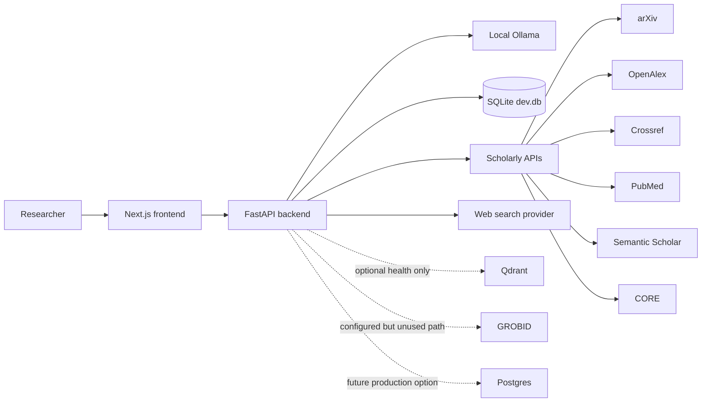
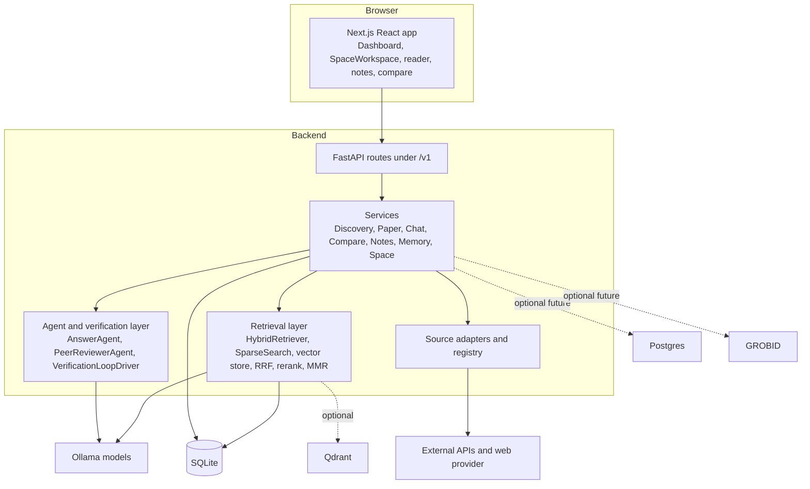
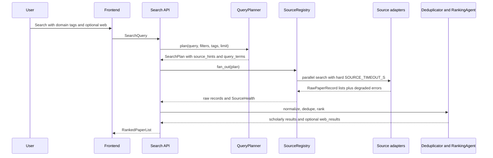
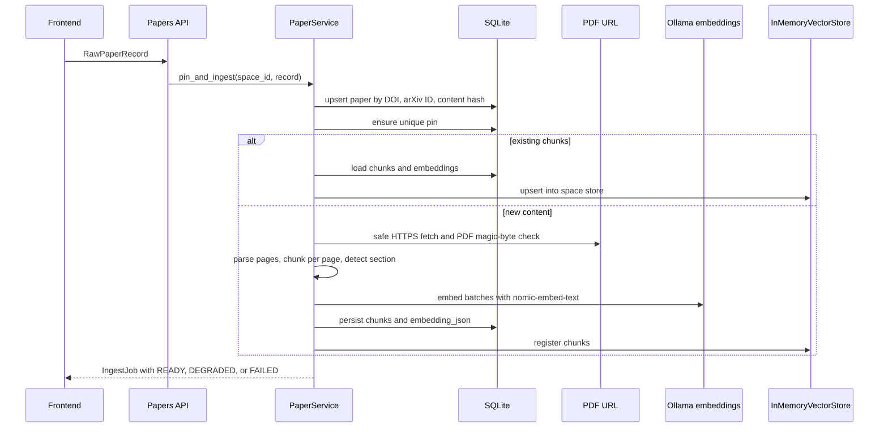
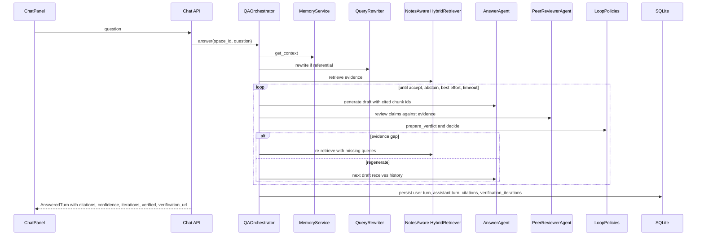
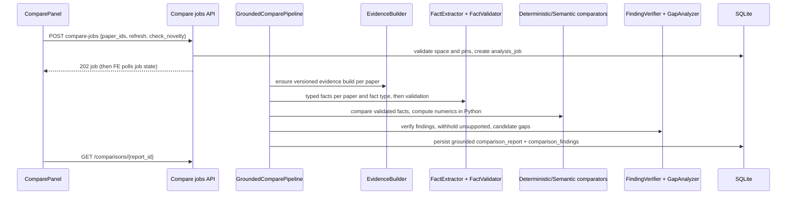
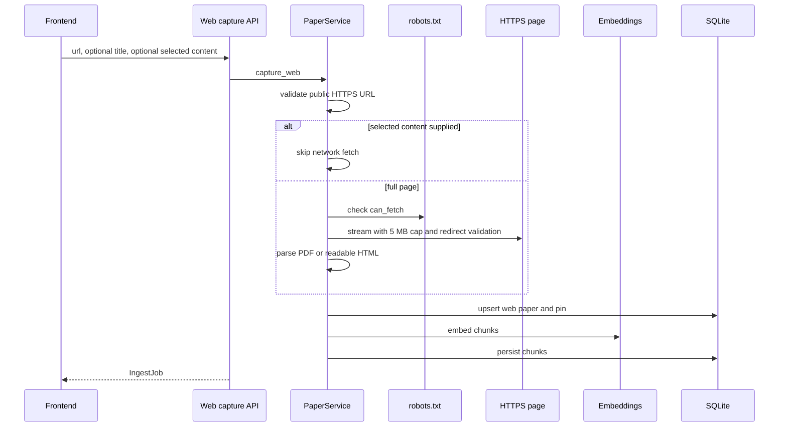
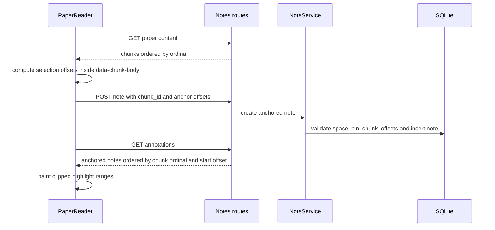
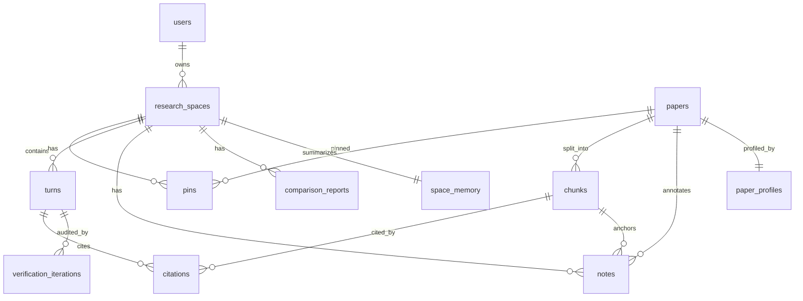

# 10. High Level Design

The product is now **R.Space** (formerly Research Assistant). This document
preserves the original design context; repository and Python package names
remain unchanged.

## Table of contents

1. Problem statement
2. Goals and non-goals
3. Requirements summary
4. System context
5. Containers
6. Major components
7. End-to-end flows
8. Data architecture
9. Key design decisions and trade-offs
10. Scalability, performance, reliability, security, and privacy
11. Capacity and latency characteristics
12. Design vs. implementation

## 1. Problem statement

Researchers need a way to discover papers, save the relevant ones, read and annotate them, and ask questions that stay grounded in the saved evidence. Generic chat systems are fast but often fabricate citations. Conventional reference managers store papers but do not verify answers. This application bridges those needs by making each research space a local evidence set and forcing answers through an auditable peer-review loop.

## 2. Goals and non-goals

### 2.1 Goals

- Support scholarly discovery across multiple public sources. Related requirements: FR-1.1, FR-1.2, FR-1.3, FR-1.8, FR-1.9.
- Let users pin papers, their own PDFs, and web captures into persistent research spaces. Related requirements: FR-2.
- Provide grounded Q&A with citations and a visible verification trail. Related requirements: FR-3 and LC-1 through LC-12.
- Provide compare and gap analysis over selected pinned papers. Related requirements: FR-4.
- Provide notes, auto notes, anchored annotations, memory, and content search. Related requirements: FR-5 and FR-6.
- Keep inference local through Ollama and minimize external data egress. Related requirements: NFR-3 and NFR-6.
- Authenticate local accounts and constrain workspace/paper operations to their owner. Selective note/finding exports are reviewed in a preview; optional LinkedIn publishing is a separate OAuth connection, not an app sign-in mode.
- First-admin setup claims intact legacy spaces and papers without renumbering rows; pre-existing orphan references are audited and shown as degraded, while new integrity violations or ambiguous owners abort the claim.
- OpenAlex identification is optional and per-member: a first-sign-in choice and later Settings control determine whether that member's contact address is sent on their own searches. Declining or skipping keeps searches unidentified; the pooled HTTP transport holds no per-member headers.
- Discovery caches only successful per-source candidates for 15 minutes, bounded by 256 entries and 32 MiB. Exact query, source/provider and authenticated owner isolate each entry; deduplication and ranking run on every cache hit.

### 2.2 Non-goals

- No public registration, third-party sign-in, or production Postgres deployment; the SQLite Alembic chain and local account ownership are implemented.
- No Celery worker queue, LangGraph orchestration, or durable distributed graph state.
- No required Qdrant or GROBID service in the working path.
- No backend scraping of Google Scholar.

## 3. Requirements summary

| Area | Implemented status |
|---|---|
| FR-1 Discovery | Implemented through adapters for arXiv, OpenAlex, Crossref, PubMed, Semantic Scholar, CORE, and optional web. Domain tags bias routing and ranking. |
| FR-2 Paper ingestion | Implemented for pinned records, locally uploaded PDFs, abstracts, and web captures. Uploaded originals live in private per-owner storage outside the repository; chunks are persisted with embeddings in SQLite and loaded into an in-memory vector store. Image-only PDFs remain explicitly degraded until OCR. |
| FR-3 Grounded Q&A | Implemented through `QAOrchestrator`, `HybridRetriever`, `AnswerAgent`, `PeerReviewerAgent`, and `VerificationLoopDriver`. |
| FR-4 Compare and gap | Implemented through paper profiles, compare and gap agents, cached `comparison_reports`, and verification of conclusions. |
| FR-5 Notes | Implemented for manual notes, auto notes, anchored highlights, reader annotations, CRUD, and note context augmentation. |
| FR-6 Memory | Implemented as rolling summary, findings, open questions, recent turns, and recall in `MemoryService`. |
| NFR-1 Performance | Bounded by hard per-source deadlines, context budgets, and loop wall-clock caps. Local model latency dominates. |
| NFR-2 Accuracy | Verification loop enforces claim coverage, citation validity, and low-confidence warnings. |
| NFR-3 Privacy | LLM and embeddings use local Ollama. Discovery and web capture call external sources only for user-initiated searches and captures. |
| NFR-5 Reliability | Degrades per source, uses circuit breakers, SQLite retry on lock, and safe best-effort finalizers. |
| NFR-6 Security | URL validation rejects non-HTTPS, private, loopback, link-local, multicast, and reserved addresses; prompts delimit untrusted evidence. |

## 4. System context

## 5. Container diagram

## 6. Major components

| Component | Responsibility | Key files |
|---|---|---|
| Frontend dashboard | Create, rename, duplicate, archive, unarchive, delete spaces; display health. | `frontend\components\dashboard.tsx` |
| Space workspace | Tabs for library (opening module), chat, compare and notes; each module uses a shared main-plus-context-rail layout; reader modal and command palette. | `frontend\components\space-workspace.tsx`, `frontend\components\workspace\*.tsx` |
| Chat module | Chat sessions (new, rename, pin, archive, search, delete, arrow navigation), @-mentions, compression, citation-to-passage links. | `frontend\components\chat\*.tsx`, `frontend\lib\chat-sessions.ts` |
| API router | Mounts admin, spaces, search, papers, chat, compare, notes, verification routes. | `backend\app\api\router.py` |
| Discovery service | Plan, fan out, normalize, deduplicate, rank, and partition web results. | `services\discovery_service.py` |
| Source registry | Source ordering, circuit breaker use, hard per-source asyncio timeout. | `sources\registry.py` |
| Paper service | Pin, ingest, web capture, chunk, embed, persist, unpin, status and content. | `services\paper_service.py` |
| Retrieval | Dense plus sparse search, RRF fusion, rerank, MMR, evidence packing. | `retrieval\*.py` |
| Chat service | Session-scoped memory context, query rewrite, verification loop, persistence of turns, citations, traces. | `services\chat_service.py` |
| Chat session service | Session CRUD, search, pin/archive, mention context, conversation compression. | `services\chat_session_service.py` |
| Verification loop | Bounded async loop for draft, review, route, refine, re-retrieve, accept, best-effort, abstain. | `verification\loop.py`, `verification\policies.py` |
| Compare service | Profiles, matrix, gaps, conclusion verification, cache by paper set. | `services\compare_service.py` |
| Notes service | Auto notes, manual notes, anchors, annotation retrieval, note chunks in retrieval. | `services\note_service.py` |
| Persistence | SQLAlchemy models with SQLite development database. | `models\*.py`, `core\dependencies.py` |

## 7. End-to-end flows

### 7.1 Discovery with domain tags and optional web results

### 7.2 Paper pin, ingest, and embed

### 7.3 Grounded Q&A through verification loop

### 7.4 Compare and gap

### 7.5 Web capture

### 7.6 Annotation

## 8. Data architecture

Storage choices: SQLite is used for the delivered local development application; embeddings are stored in `chunks.embedding_json` so the system can rehydrate without Qdrant; `InMemoryVectorStore` provides runtime cosine search; `verification_iterations` stores audit records; notes store optional paper, chunk, quote, offsets, and color.

## 9. Key design decisions and trade-offs

| Decision | Rationale | Trade-off |
|---|---|---|
| Local Ollama for LLM and embeddings | Preserves privacy and avoids hosted LLM cost. | Latency and quality depend on local hardware and small models. |
| Plain async verification loop instead of LangGraph | Faster to implement and easier to test as normal Python. | No graph checkpointing or visual orchestration. |
| SQLite plus in-memory vector store | Zero-service local quickstart and deterministic tests. | Not suitable for high concurrency or large corpora. |
| Store embeddings in SQLite JSON | Allows rehydration after restart without vector DB. | Slow and space-inefficient at scale. |
| Hard per-source `asyncio.timeout` | Keeps slow APIs from blocking fan-out. | Some slow-but-valid responses are discarded. |
| Semantic Scholar requires API key | Avoids unauthenticated rate-limit failures. | Search can appear degraded until configured. |
| pypdf page extraction instead of GROBID | Simple local dependency and page numbers. | No layout-aware scholarly structure. |
| ContextBuilder word budget of 1800 | Prevents Ollama context overflow and empty drafts. | Some relevant chunks are omitted. |
| Best-effort finalizer strips unsupported claims | Safer than returning a fully rejected draft. | Answers may be partial. |

## 10. Scalability, performance, reliability, security, and privacy

Current scale target is local or demo use. The main bottlenecks are local model latency, SQLite write serialization, and in-memory vector search. The architecture can evolve by swapping SQLite for Postgres, replacing `InMemoryVectorStore` with Qdrant, and moving ingestion to a worker queue, but those are not implemented.

Performance controls include concurrent source fan-out, hard per-source deadlines, identifier-indexed dedupe, embedding batches of 32, dense and sparse hit limits, rerank and MMR limits, and an 1800-word context budget.

Reliability controls include circuit breakers, source health returned to the UI, SQLite locked retries, explicit ingest states, and verification fallbacks for timeout and `LLMUnavailableError`.

Security and privacy controls include public-HTTPS URL validation, redirect revalidation, 30 MB PDF cap, 5 MB web capture cap, PDF magic-byte checks, robots.txt checks for full web capture, untrusted evidence delimiters in prompts, and local-only LLM inference.

## 11. Capacity and latency characteristics

| Operation | Characteristic |
|---|---|
| Scholarly search | About 4 to 13 seconds depending on public API throttling and degraded sources. |
| Chat with verification | About 20 to 90 seconds on local models, longer if the wall-clock cap is raised. |
| Paper ingest | About 6 to 17 seconds per paper, depending on PDF download, parsing, and embedding. |
| Deduplication | Optimized from O(n squared) behavior to about 2 ms for typical fan-out batches. |
| Context packing | Bounded to prevent empty drafts caused by oversized local model prompts. |

## 12. Design vs. implementation

The old `docs\01-requirements.md`, `02-architecture.md`, `03-file-structure.md`, and `04-system-design.md` were design-phase documents. The delivered implementation differs in these important ways:

| Design-phase claim | Actual delivered system |
|---|---|
| LangGraph orchestrates the QA graph. | No LangGraph is wired. `VerificationLoopDriver` is a plain async loop. |
| Celery and Redis run ingestion jobs. | Ingestion runs in-process inside API requests. Redis is configured only as a setting. |
| Qdrant stores embeddings. | Qdrant has a health stub, but the working path stores embeddings in SQLite JSON and loads `InMemoryVectorStore`. |
| Postgres is the primary database. | SQLite `backend\data\dev.db` is the actual default. |
| GROBID parses PDFs. | PDFs are parsed with `pypdf`; GROBID is only a setting. |
| Production auth and multi-tenancy. | Local Argon2id accounts, revocable sessions, per-user spaces/papers and owner-scoped routes are implemented; HTTPS and distributed hardening are not. |
| Cross-encoder reranker. | Reranking is a lightweight lexical overlap heuristic. |
| Exact-paper lookup route. | Interface hooks exist, but no live route implements exact lookup. |
| Alembic migrations. | Explicit SQLite revisions validate legacy schemas and preserve rows; startup rejects databases without head. |
